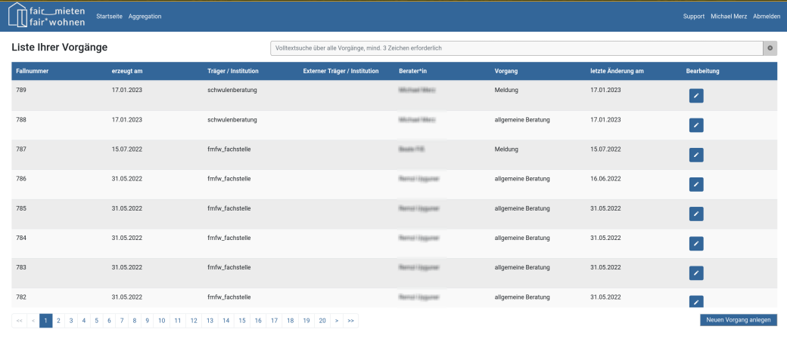

# System zur Dokumentation von Diskriminierungsfällen auf dem Wohnungsmarkt

## Berliner Fachstelle Fair mieten - Fair wohnen  

Das Dokumentationssystem der Berliner Fachstelle gegen Diskriminierung auf dem Wohnungsmarkt, Fair mieten – Fair wohnen: Ein Baustein zur Professionalisierung der Beratungsarbeit und strategisches Instrument der Antidiskriminierungsarbeit

Ein professionellen Standards entsprechendes Fallmanagement und eine gut nachvollziehbare Dokumentation der Beratungsarbeit sind Voraussetzungen für jede gute Praxis sozialer und damit auch der Antidiskriminierungs-Beratung. Beides ist Voraussetzung für eine schlüssige, rechtssichere und fachlich sowie politisch auswertbare Verfolgung von Diskriminierungsfällen.

Für die Dokumentation werden in der Berliner Antidiskriminierungs-Arbeit, aber auch bundesweit unterschiedliche Systeme genutzt. Die 2017 gegründete Berliner Fachstelle gegen Diskriminierung auf dem Wohnungsmarkt, Fair mieten – Fair wohnen, hat für ihre Falldokumentation und als Grundlage der strategischen Arbeit  in Zusammenarbeit mit anderen Akteuren der Antidiskriminierungs-Arbeit ein onlinebasiertes Dokumentationssystem entwickelt (vgl. Dokumentation dazu auf der [Internetseite der Fachstelle](https://fairmieten-fairwohnen.de/)). Die Fachstelle stellt es mit Blick auf den wachsenden Bedarf für ein solches Instrument nun als Open Source Produkt zur Verfügung.

Das Dokumentationssystem ermöglicht, Beratungsanfragen systematisch zu dokumentieren und macht dabei typische Fallkonstellationen sichtbar. Gut dokumentierte und anonymisierte Fälle bieten in der Aggregation eine Grundlage, über den Einzelfall hinaus eine fallübergreifende und zusammenfassende Öffentlichkeitsarbeit zu leisten. Dies stärkt die Entwicklung von Strategien gegen Diskriminierung und die fachpolitische Mobilisierung und erhöht damit die Erfolgschancen der Beratung.

Das Dokumentations-System der Fachstelle wurde von einem externen Software-Entwicklerteam umgesetzt. Konzeptionsgrundlage war eine Auswertung existierender Dokumentationssysteme, Expert*innen-Interviews im Team der Fachstelle und von der Fachstelle geführte Interviews mit Expert*innen aus anderen Berliner Beratungsstellen. Das System ist abgestimmt auf die Bedürfnisse der Beratungsarbeit im Bereich Wohnen. Es ist kein statisches Programm, sondern kann weiterentwickelt werden.  Für die Fachstelle ist dies wichtig, weil sie immer wieder neuen Diskriminierungsformen bzw. -konstellationen begegnet.

Das Dokumentationssystem entspricht natürlich den gesetzlichen Datenschutz-Vorgaben. Dies vor Allem weil Datensparsamkeit bei der Konzeption von Anfang an ein Designziel gewesen ist.

Personenbezogene Daten werden nur für den Zweck der Fallbetreuung eingegeben. Bei einer Fallbetreuung handelt es sich um einen komplexen Beratungsprozess, bei dem die Fachstelle auf das Speichern von personenbezogenen Daten angewiesen ist. Diese Daten können nur von Mitarbeiter*innen der Fachstelle eingesehen werden, die per Arbeitsvertrag explizit zum Datenschutz verpflichtet sind.

Für das Speichern von personenbezogenen Daten holt sich die Fachstelle eine Einverständniserklärung der ratsuchenden Person ein. Der Server, auf dem die Daten des Dokumentationssystems gespeichert werden, steht in Deutschland und die Fachstelle hat mit den Dienstleistern für den Betrieb eine DSGVO-konforme vertragslage geschaffen.



# Technik

## Used Versions

* [Play Framework: 2.6.20](https://www.playframework.com/documentation/2.6.x/Home)
* [Angular: 6.0.0](https://angular.io/)
* [Angular CLI: 1.6.6](https://cli.angular.io/)

## How to use it?

### Prerequisites

* [Node.js](https://nodejs.org/)
* [JDK](http://www.oracle.com/technetwork/java/javase/downloads/index.html)

### Let's get started,

* Fork or clone this repository.

* Used any of the following [SBT](http://www.scala-sbt.org/) commands which will intern trigger frontend associated npm scripts.

```
    sbt clean           # Clean existing build artifacts

    sbt stage           # Build your application from your project’s source directory

    sbt run             # Run both backend and frontend builds in watch mode

    sbt dist            # Build both backend and frontend sources into a single distribution artifact

    sbt test            # Run both backend and frontend unit tests
```

## DB setup

```
    CREATE USER 'adwdoc'@'localhost' IDENTIFIED BY 'adwdoc';
    CREATE DATABASE adwdoc CHARACTER SET utf8 COLLATE utf8_unicode_ci;
    GRANT ALL PRIVILEGES ON adwdoc.* TO 'adwdoc'@'localhost';

    CREATE USER 'keycloak'@'%' IDENTIFIED BY 'keycloak';
    CREATE DATABASE keycloak CHARACTER SET utf8 COLLATE utf8_unicode_ci;
    GRANT ALL PRIVILEGES ON keycloak.* TO 'keycloak'@'%';
    
     flush privileges;
```

## Keycloak DB Setup

[Keycloak MySQL Setup](https://github.com/Codingpedia/codingmarks-api/wiki/Keycloak-MySQL-Setup)